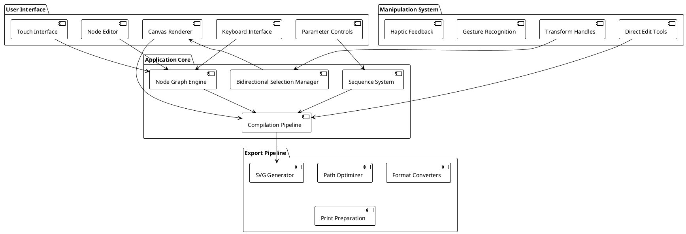
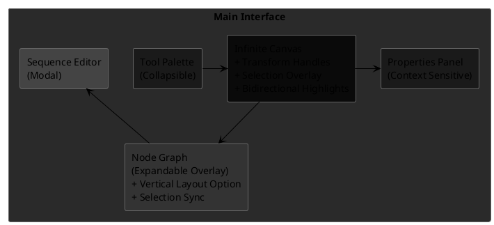

# Generative Art IDE: Visual Programming Blueprint

## Vision

A touch-enabled visual programming environment that transforms the neurofuzzy/stamp library into an intuitive creative tool. This IDE makes generative art accessible through direct manipulation while providing robust keyboard support as a fallback, preserving the mathematical sophistication of the underlying system.

## Core Design Principles

### Touch-Enabled Interface
Every interaction optimized for finger and stylus input with keyboard shortcuts as reliable fallbacks. Large touch targets, gesture-based navigation, and haptic feedback create a natural creative flow. The interface adapts seamlessly between desktop mouse, trackpad, touch input, and traditional keyboard workflows.

### Bidirectional Selection (Core Workflow)
**Critical user workflow element**: Selecting shapes on canvas automatically highlights corresponding nodes in the graph, and vice versa. This bidirectional selection system forms the foundation of user understanding, allowing immediate navigation between visual results and their underlying logic. Selection state synchronizes across all interface views with clear visual indicators.

### Zero Keyboard Requirement with Keyboard Enhancement
Complete functionality through visual interaction alone, with keyboard shortcuts enhancing efficiency for power users. Parameter adjustment via sliders, dials, and direct manipulation. Text input available for naming, expressions, and advanced operations, but never required for core functionality.

### Intuitive Discovery
Features reveal themselves through interaction. Hover/touch states show available actions. Progressive disclosure guides users from simple to complex functionality naturally.

### Immediate Feedback
Every action provides instant visual response. Parameter changes update the canvas in real-time. No compilation delays or waiting states during creative flow.

### Dark Mode Interface with Flexible Canvas
Interface defaults to dark mode for reduced eye strain during extended creative sessions. Canvas background supports black, white, or dark grey options to accommodate different artistic needs and output requirements while maintaining optimal contrast for UI elements.

## System Architecture

## Interface Layout

## Core Modules

### Bidirectional Selection Manager
**Core system orchestrating the primary user workflow**: Maintains synchronized selection state between canvas shapes and graph nodes. Provides immediate visual feedback when selections change in either view. Handles multi-selection scenarios with clear hierarchy indicators. Updates transform handles and property panels based on current selection context.

### Node Graph Engine
Manages the visual programming graph connecting shape creation, transformations, and boolean operations. **Supports both horizontal and vertical node layout options** to accommodate different screen orientations and user preferences. Handles node connections, dependency tracking, and execution order. Provides visual feedback for data flow and parameter binding with clear selection synchronization.

### Universal Parameter System
Every parameter accepts static values, sequence references, or mathematical expressions. Provides consistent interface for binding any value to procedural sources. Automatically detects parameter types and offers appropriate input methods including touch controls and keyboard shortcuts.

### Touch-Enabled Interface Manager
Orchestrates all touch interactions with keyboard fallbacks including multi-touch gestures, pressure sensitivity, and palm rejection. Provides consistent touch targets sized for finger input while maintaining keyboard accessibility. Handles gesture recognition for pan, zoom, rotate, and selection operations with corresponding hotkey alternatives.

### Canvas Renderer
High-performance rendering engine supporting thousands of shapes with smooth zoom and pan. Implements level-of-detail rendering for complex scenes. **Renders bidirectional selection highlights** connecting shapes to their corresponding nodes. Provides real-time preview of all parameter changes with sub-frame latency.

### Transform Handle System
Generates contextual manipulation handles for selected shapes with keyboard shortcut alternatives. Provides direct editing of position, size, rotation, and shape-specific parameters. Updates source node parameters in real-time during manipulation with **immediate node graph synchronization**. Includes constraint systems for precise editing accessible via both touch and keyboard.

### Sequence Engine Integration
Visual interface for creating and editing the stamp library's powerful sequence system. Provides drag-and-drop sequence building with keyboard navigation support, timeline scrubbing, and live value preview. Handles complex sequence dependencies and mathematical expressions with full keyboard editing capabilities.

### Compilation Pipeline
Converts node graphs into executable stamp operations with incremental compilation for performance. Tracks dependencies to minimize recomputation. Provides visual feedback during compilation and error reporting with selection context awareness.

### Export System
Generates production-ready output in multiple formats. Optimizes paths for plotting and fabrication. Supports batch generation with parameter variations. Maintains export history and version control with keyboard-accessible controls.

## Interface Design

### Tool Palette
**Collapsible sidebar** containing shape primitives, operations, and utilities. **Large touch-friendly icons** with keyboard shortcuts displayed. **Drag-and-drop** to canvas or node graph with keyboard alternatives. **Organized categories** with smooth expand/collapse animations and hotkey navigation.

**Shape Tools**: Circle, Rectangle, Polygon, Arch, Bone, Leaf, Tangram variants
**Operations**: Union, Subtract, Intersect, Transform tools  
**Layouts**: Grid, Scatter, Path-based arrangements
**Utilities**: Sequences, Variables, Export nodes

### Infinite Canvas
**Boundless workspace** with smooth pan and zoom via touch and keyboard. **Multi-touch support** with WASD/arrow key navigation. **Shape instances** render with high-fidelity preview and **bidirectional selection indicators** connecting to node graph. **Selection overlays** show active elements with animated borders synchronized across all views. **Canvas background** switchable between black, white, or dark grey to suit artistic requirements while maintaining interface dark mode.

**Direct manipulation handles** appear on selection:
- **Move handles** at shape centers (keyboard: arrow keys)
- **Resize handles** at corners and edges (keyboard: Shift+arrows)
- **Rotation handles** with circular gesture areas (keyboard: R+drag or angle input)
- **Custom handles** for shape-specific parameters (keyboard: context-sensitive shortcuts)

**Visual feedback** includes:
- **Connection lines** showing bidirectional node-to-shape relationships
- **Ghosting** for drag operations
- **Snap guides** for alignment (keyboard: hold Shift)
- **Grid overlay** when needed (keyboard: G to toggle)
- **Canvas background controls** for switching between black, white, and dark grey (keyboard: B to cycle)

### Properties Panel
**Context-sensitive panel** adapting to current selection with keyboard navigation. **Touch-optimized controls** with keyboard input alternatives. **Real-time parameter adjustment** with immediate visual feedback and **node graph synchronization**.

**Parameter Types**:
- **Sliders** for numeric ranges with drag, tap, and direct keyboard input
- **Dials** for rotational values with gesture support and number key input
- **Color wells** with palette and picker integration (keyboard: hex entry)
- **Toggle switches** for boolean values (keyboard: spacebar)
- **Dropdown selectors** for enumerated options (keyboard: up/down arrows)

**Advanced Parameters**:
- **Sequence binding** with visual connection indicators and keyboard shortcuts
- **Expression editor** with autocomplete, syntax highlighting, and full keyboard support
- **Grid controls** for layout parameters with numeric input
- **Style inheritance** visualization with keyboard navigation

### Node Graph Overlay
**Expandable overlay** revealing the visual programming graph with keyboard toggle (N key). **Smooth slide-up animation** from canvas bottom. **Touch-friendly nodes** with large connection ports and **vertical layout option** for portrait orientations or user preference.

**Node Visualization**:
- **Shape nodes** with preview thumbnails and **bidirectional selection highlights**
- **Operation nodes** with symbolic representations
- **Sequence nodes** with live value displays
- **Connection wires** showing data flow with selection-aware highlighting

**Layout Options**:
- **Horizontal layout** (default): Traditional left-to-right node flow
- **Vertical layout**: Top-to-bottom arrangement for mobile/portrait screens
- **Automatic layout**: Adapts based on screen orientation and available space

**Interaction**:
- **Drag connections** between compatible ports (keyboard: Tab to navigate, Enter to connect)
- **Node selection** syncs with canvas selection with clear visual feedback
- **Parameter editing** through direct manipulation and keyboard input
- **Collapse/expand** for complex subgraphs (keyboard: +/- keys)

### Sequence Editor
**Modal interface** for building complex sequences with full keyboard support. **Timeline visualization** showing value progression. **Drag-and-drop** sequence building with keyboard alternatives and visual flow.

**Components**:
- **Value generators** (ranges, lists, mathematical functions)
- **Playback modes** (repeat, yoyo, shuffle, random)
- **Transformers** (scale, offset, accumulate)
- **Combiners** (mathematical expressions, conditionals)

**Preview System**:
- **Live value display** showing current sequence output
- **Timeline scrubber** for exploring sequence behavior (keyboard: left/right arrows)
- **Dependency graph** showing sequence relationships with **bidirectional selection**
- **Value history** with graphical representation

## Touch and Keyboard Interaction Patterns

### Canvas Navigation
**Touch**:
- **Two-finger pan** for smooth navigation
- **Pinch zoom** with momentum and bounce
- **Double-tap** to fit selection or zoom to specific areas
- **Three-finger tap** to reset view

**Keyboard**:
- **WASD or arrow keys** for panning
- **+/- or scroll wheel** for zooming
- **F** to fit selection to view
- **0** to reset view to origin
- **B** to cycle canvas background (black/white/dark grey)

### Shape Manipulation
**Touch**:
- **Single tap** to select individual shapes
- **Multi-tap** to add to selection
- **Long press** for context menus
- **Drag** to move selected objects
- **Pinch on selection** to resize proportionally
- **Rotate gesture** around selection center

**Keyboard**:
- **Click** to select with **immediate node synchronization**
- **Ctrl+click** to add to selection
- **Right-click** for context menus
- **Arrow keys** to move selection
- **Shift+arrows** to resize
- **R+drag** or angle input for rotation

### Bidirectional Selection Workflow
**Primary user interaction**: Selecting any shape immediately highlights its corresponding node(s) with animated connection lines. Selecting any node immediately highlights its output shape(s) on canvas. Multi-selections maintain synchronization across both views with clear visual hierarchy.

**Visual Indicators**:
- **Shape selection borders** with color-coded node connections
- **Node selection highlights** with animated pulses to corresponding shapes
- **Connection path animation** showing data flow during selection
- **Hierarchy indicators** for complex multi-node selections

### Handle Interaction
**Touch**:
- **Tap handle** to activate with haptic feedback
- **Drag handle** for precise parameter adjustment with **real-time node updates**
- **Double-tap handle** to enter specific value
- **Constrained dragging** with visual feedback for locked axes

**Keyboard**:
- **Tab** to cycle through available handles
- **Enter** to activate numerical input
- **Shift** to constrain transformations
- **Escape** to cancel operations

### Node Graph
**Touch**:
- **Tap node** to select and sync canvas with **bidirectional highlighting**
- **Drag nodes** to reorganize graph layout
- **Tap ports** to initiate connections
- **Swipe nodes** for quick parameter access
- **Pinch graph** to zoom node view
- **Rotate gesture** to switch between horizontal and vertical layouts

**Keyboard**:
- **Tab** to navigate between nodes
- **Enter** to select node and sync canvas
- **Spacebar** to initiate connections
- **Delete** to remove selected nodes
- **V** to toggle vertical/horizontal layout
- **Numbers** for quick parameter input

## Development Phases

### Phase 1: Foundation
Core touch-enabled interface with keyboard fallbacks for basic shapes and canvas navigation. **Bidirectional selection system implementation**. Simple parameter adjustment through sliders, handles, and keyboard input. **Vertical node layout option**. Basic selection and direct manipulation. Essential export functionality.

### Phase 2: Node System Enhancement
Advanced visual programming graph with optimized touch and keyboard interactions. **Complete bidirectional selection synchronization** with visual feedback systems. Basic sequence integration. Transform handle system completion with keyboard alternatives.

### Phase 3: Advanced Sequences
Complete sequence editor with visual building blocks and full keyboard support. Mathematical expression support with syntax highlighting. Complex parameter binding. Advanced selection and manipulation features with **enhanced bidirectional workflow**.

### Phase 4: Professional Tools
Performance optimization for complex scenes. Advanced export formats and batch processing. Template system and asset management. Touch gesture refinement, haptic feedback, and comprehensive keyboard shortcut system.

## Success Criteria

### Usability Goals
- **New users** create their first generative art within 5 minutes using either touch or keyboard
- **Complex operations** achievable entirely through touch with keyboard enhancement options
- **Parameter discovery** through natural interface exploration
- **Bidirectional selection workflow** becomes intuitive within first use session
- **Creative flow** maintained without technical interruptions across input methods

### Technical Performance
- **60fps rendering** with thousands of visible shapes and selection synchronization
- **Real-time compilation** under 100ms for typical graphs with bidirectional updates
- **Responsive input** with sub-20ms latency for both touch and keyboard
- **Smooth animations** throughout the interface including selection transitions

### Accessibility
- **Touch targets** minimum 44pt for comfortable finger use
- **Keyboard navigation** for all primary functions
- **Visual feedback** for all interactive elements including selection states
- **Progressive disclosure** preventing interface overwhelm
- **Input method alternatives** for all core workflows

This blueprint creates an intuitive visual programming environment that honors the mathematical power of generative art while making it accessible through natural, touch-enabled interaction enhanced by comprehensive keyboard support. The bidirectional selection system ensures users always understand the relationship between their visual results and underlying logic, forming the foundation of an effective creative workflow.